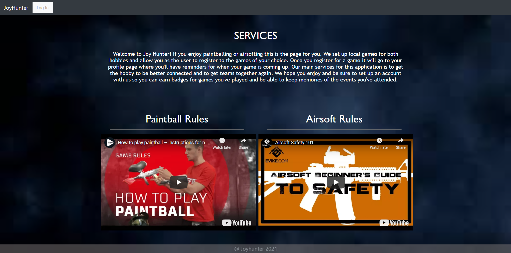
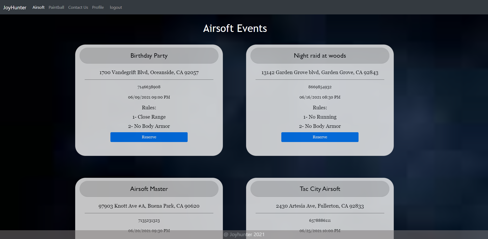
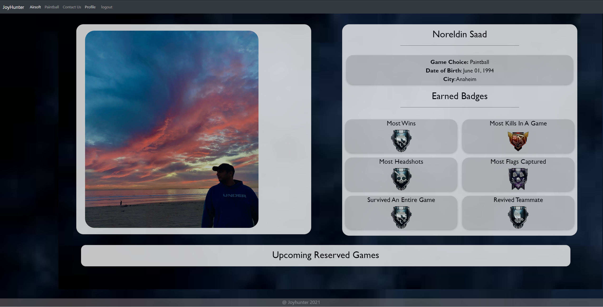

# Joyhunter 
  
## Table of Contents
-  [Description](#description)
-  [Deployed link](#Deployment)  
-  [Technologies](#technologies)  
-  [Developers](#developers)  
-  [Images](#images)  

## Description
Airsoft and paintball app that allows you to find upcomming games near your area.  
Users are able to reserve multiple games to get an estimate of attendees.  
Personal profile that tracks your wins, k/d ratio, and headshots.  

# Deployment
[Heroku](https://joyhunter2.herokuapp.com/)

## Technologies
Front-end: React, HTML, CSS  
Back-end: Auth0, EmailJS, Express, Heroku, mySQL  
Dev Tools: Trello  

## Developers
This project was created by the following developers:
-  [Clint Rizzo](https://github.com/clintrizzo) 
-  [Elton Lac](https://github.com/eelac) 
-  [Jessica Chen](https://github.com/jiayc1) 
-  [Noreldin Saad](https://github.com/Noreldin-S)  

## Images
Main Page
  
 
Event Reservation
   
 
Profile
  
 
Contact
  
